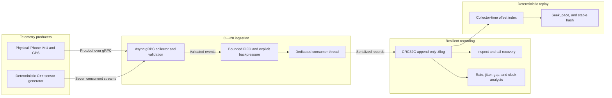

# TraceForge

TraceForge is a C++20 multi-sensor telemetry recorder and deterministic replay
engine. The project explores the systems problems behind ingesting concurrent
sensor streams, preserving timing and ordering information, recovering from
partial writes, and reproducing a recorded session reliably.

## Status

TraceForge currently provides a strict C++20 build, Linux continuous
integration, a versioned Protobuf telemetry contract, an asynchronous C++ gRPC
collector with bounded ingestion, a deterministic multi-sensor workload
generator, and a Flutter client for reading and streaming real phone motion and
location sensors. Accepted events can be persisted in a versioned, checksummed
append-only log with interrupted-tail recovery and indexed deterministic replay.
The `analyze` command turns a validated recording into per-producer integrity
and per-sensor timing diagnostics without exposing payload values.

The physical path has been validated on an iPhone 16 Pro Max: an 80.5-second
Wi-Fi session delivered 8,114 accelerometer, gyroscope, and GPS events to the
C++ collector with zero rejected events or sequence gaps. The finalized log
passed CRC and Protobuf validation and replayed all 8,114 records with the same
stable hash.

## Highlights

- Real accelerometer, gyroscope, and GPS streaming from a physical phone.
- Concurrent producer ingestion through an asynchronous C++ gRPC service.
- Bounded buffering with explicit overload and backpressure behavior.
- Versioned, CRC32C-protected append-only recording.
- Recovery of every complete record after an interrupted final write.
- Indexed seeking and deterministic replay with a stable content hash.
- Per-stream rate, jitter, timestamp-regression, sequence-gap, and clock-delta
  analysis.
- Malformed-input, concurrency, and recovery coverage under fuzzers and
  sanitizers.
- Reproducible latency, throughput, memory, and before/after optimization data.

## Architecture



The callback path validates and enqueues; it never performs disk work. The
fixed-capacity queue prevents unbounded memory growth and rejects an overloaded
stream explicitly. A dedicated worker owns append-only recording, while replay
indexes compact metadata and reads payloads by file offset. Collector-arrival
timestamps define cross-producer ordering because phone and collector source
clocks are intentionally treated as separate domains.

## Verified physical run

The following result was captured on August 27, 2026 using an iPhone 16 Pro Max
on the same Wi-Fi LAN as the collector. Payload values such as GPS coordinates
are intentionally omitted.

| Measurement | Result |
| --- | ---: |
| Capture duration | 80.5 seconds |
| Accelerometer | 4,054 samples at 50.2 Hz observed |
| Gyroscope | 4,053 samples at 50.2 Hz observed |
| GPS | 7 samples |
| Collector accepted / rejected | 8,114 / 0 events |
| Sequence gaps | 0 |
| Queue high-water mark | 21 events |
| Consumer failures | 0 |
| Final recording | 8,114 records, 819,416 bytes |
| Immediate and 1000x replay | 8,114 / 8,114 records |
| Stable replay hash | `ac5b42e5a8547b48` |

Selected privacy-safe fields from the CLI output:

```text
collector_shutdown=signal signal=2 accepted=8114 rejected=0 consumed=8114 queue_high_watermark=21 consumer_failures=0
path=physical-session.tflog status=complete records=8114 file_bytes=819416 valid_bytes=819416
path=physical-session.tflog status=complete indexed=8114 replayed=8114 speed=0 hash=ac5b42e5a8547b48
```

One GPS source timestamp was observed as non-monotonic. TraceForge preserves
that source data but does not use it for cross-device ordering; the replay
contract uses the collector's single clock domain and append index instead.
See [`docs/demo.md`](docs/demo.md) for the complete commands, recovery example,
expected output, and a concise recording script.

## Build

Requirements:

- A C++20 compiler
- CMake 3.20 or newer
- Protobuf and its compiler
- gRPC C++ and the gRPC Protobuf compiler plugin

On macOS with Homebrew:

```sh
brew install cmake protobuf grpc
```

On Ubuntu:

```sh
sudo apt-get install libgrpc++-dev libprotobuf-dev \
  protobuf-compiler protobuf-compiler-grpc
```

```sh
cmake -S . -B build -DCMAKE_BUILD_TYPE=Debug
cmake --build build --parallel
ctest --test-dir build --output-on-failure
```

Run the CLI:

```sh
./build/traceforge --help
./build/traceforge --version
```

Run the asynchronous collector on the default insecure development endpoint:

```sh
./build/traceforge collect --listen 0.0.0.0:50051
```

The ingestion protocol is defined in
`proto/traceforge/v1/telemetry.proto`. Every event carries a schema version,
producer identity, monotonically increasing sequence number, source timestamp,
explicit clock domain, and typed payload. The collector validates events,
captures its own arrival timestamp, reports sequence gaps, and returns explicit
gRPC errors for invalid input or an overloaded sink.

### Bounded ingestion and backpressure

gRPC callback threads never perform consumer work directly. Accepted events
move into a fixed-capacity FIFO, and one worker drains that queue into the next
pipeline stage. The queue tracks accepted and rejected events, current depth,
and its high-water mark.

The overload policy is explicit: TraceForge does not block an asynchronous RPC
thread and does not silently drop an event. If the queue is full, the affected
producer stream ends with gRPC `RESOURCE_EXHAUSTED`; other streams remain
independent. A stopped or failed pipeline returns `UNAVAILABLE`.

Queue capacity is configurable. An artificial consumer delay makes overload
behavior reproducible during development:

```sh
./build/traceforge collect \
  --listen 0.0.0.0:50051 \
  --queue-capacity 64 \
  --consumer-delay-us 5000
```

Automated tests exercise FIFO draining, fixed memory bounds, concurrent queue
producers, six simultaneous gRPC streams, producer reconnection, and overload
status propagation.

The collector handles `SIGINT` and `SIGTERM` as graceful shutdown requests. It
stops gRPC, drains accepted queue entries, flushes the recording, and reports
final accepted, rejected, consumed, high-watermark, and consumer-failure
counters before exiting.

### Binary recording and recovery

Pass an output file to persist the queue consumer's accepted events:

```sh
./build/traceforge collect \
  --listen 0.0.0.0:50051 \
  --output session.tflog \
  --flush-every 64
```

Inspect the file header, every record header, CRC32C checksums, declared payload
lengths, contiguous record indexes, and Protobuf payloads:

```sh
./build/traceforge inspect session.tflog
```

If a shutdown interrupts only the final record, recover all prior complete
records:

```sh
./build/traceforge recover session.tflog
```

Recovery refuses completed-record corruption; it never silently truncates past
a checksum error. The complete byte layout and durability semantics are in
[`docs/recording-format.md`](docs/recording-format.md).

### Session analysis

Summarize a completed recording without printing sensor payload values:

```sh
./build/traceforge analyze session.tflog
```

The command reports duration, producer sequence gaps, non-increasing sequence
numbers, per-stream observed rate, median inter-arrival time, p95 jitter, source
timestamp regressions, fault severity counts, and UTC arrival-delta quantiles.
For example:

```text
path=session.tflog status=complete records=2369 file_bytes=239171 duration_s=23.399
producer=demo-iphone records=2369 sequence_gaps=0 non_increasing_sequences=0
stream=demo-iphone/accelerometer records=1177 rate_hz=50.258 interarrival_p50_ms=19.898 jitter_p95_ms=12.776 source_timestamp_regressions=0
stream=demo-iphone/gyroscope records=1176 rate_hz=50.293 interarrival_p50_ms=19.881 jitter_p95_ms=15.153 source_timestamp_regressions=0
```

UTC arrival delta means `collector arrival - source timestamp`; it includes
device/collector clock offset and sensor batching, so it must not be described
as pure network latency. Exact metric definitions and edge cases are in
[`docs/analysis.md`](docs/analysis.md).

### Indexed deterministic replay

Open a validated recording, build its timestamp-to-file-offset index, and
replay immediately:

```sh
./build/traceforge replay session.tflog
```

Replay uses collector-arrival timestamps because they share one clock domain
across all producers. It orders records by that timestamp, then by append index
when timestamps are equal. Source timestamps remain available to consumers but
are not compared across incompatible device clock domains.

Seek to an inclusive collector timestamp, stop before an exclusive timestamp,
and reproduce the original timing at 2x speed:

```sh
./build/traceforge replay session.tflog \
  --from-ns 1700000000000000000 \
  --until-ns 1700000005000000000 \
  --speed 2 \
  --print-events
```

Speed `0` is the default and replays without sleeping. Every run reports a
stable 64-bit hash over the selected ordered records, their collector
timestamps, and their exact recorded Protobuf bytes. The index holds metadata
and file offsets rather than retaining every decoded event; replay seeks to
each payload and verifies its CRC32C before delivery. See
[`docs/replay.md`](docs/replay.md) for the precise window, ordering, pacing, and
hash contracts.

Generate one simulated second of telemetry and print its reproducibility hash:

```sh
./build/traceforge generate --seed 42 --duration-ms 1000
```

The default workload models a combined 100 Hz IMU stream (50 Hz accelerometer
and 50 Hz gyroscope), 30 Hz camera metadata, 10 Hz GPS, 1 Hz temperature, 2 Hz
fault monitoring, and asynchronous controller state transitions. Generation is
deterministic for a seed and supports portable integer-based timestamp jitter,
clock drift, drops, duplicates, and adjacent-event reordering:

```sh
./build/traceforge generate \
  --seed 8675309 \
  --duration-ms 5000 \
  --jitter-us 200 \
  --clock-drift-ppm 125 \
  --drop-per-million 1000 \
  --duplicate-per-million 500 \
  --reorder-per-million 500
```

Use `--print-events` to inspect the ordered event stream. Rates, fault counts,
and the hash are always reported; the hash is for reproducibility checks, not
cryptographic integrity.

With a collector running, stream the workload over seven concurrent gRPC
streams—one for each virtual producer:

```sh
./build/traceforge generate \
  --seed 42 \
  --duration-ms 1000 \
  --target 127.0.0.1:50051
```

The command reports attempted, written, and collector-accepted counts plus the
gRPC status for every producer. It exits unsuccessfully if any stream is
rejected, including intentional validation faults or queue overload. This makes
the same seeded workload reusable for normal ingestion, reconnect, and
backpressure tests.

The phone client is under `clients/flutter_sensor`:

```sh
cd clients/flutter_sensor
flutter pub get
flutter analyze
flutter test
flutter run
```

To stream from a physical phone, pass the collector Mac's LAN address through
`--dart-define=TRACEFORGE_COLLECTOR_HOST=...`; `127.0.0.1` is only the default
for a simulator running on the same Mac. See the client README for the complete
command and platform permissions. The phone and collector must share a LAN that
allows device-to-device traffic; managed guest networks commonly isolate
clients even when they show the same Wi-Fi name.

## Design direction

The core recorder and replay engine will remain in C++. Phone and web clients
will act only as data sources and debugging interfaces. Performance claims are
included only when measured with documented, reproducible commands.

## Measured performance

On a 12-core Apple M4 Pro, the reproducible 250,000-event Release benchmark
measured five-run medians of 103,715 events/s through the complete loopback gRPC
ingestion path, 12/43/81 µs p50/p95/p99 collector-queue latency, and 1,684,174
records/s for immediate replay, with zero rejected events. A profile-guided
sequential-read fast path improved replay throughput by 3.45x while preserving
the replay hash and out-of-order fallback.

The exact hardware, commands, raw metric definitions, observed ranges,
resource measurements, limitations, and before/after comparison are in
[`docs/benchmarks.md`](docs/benchmarks.md). Run
`./build/traceforge_benchmark --help` to change the event count, producer count,
or bounded queue capacity.

## Reliability tooling

TraceForge provides opt-in CMake configurations for AddressSanitizer,
UndefinedBehaviorSanitizer, and ThreadSanitizer, plus a Clang libFuzzer target
that tests both arbitrary bytes and structured mutations of valid recordings.
The exact local and CI commands, instrumentation boundary, and documented gRPC
TSan exclusion are in [`docs/testing.md`](docs/testing.md).

## Limitations and next extension

- Development transport is insecure local-network gRPC, not an internet-facing
  service.
- The physical result is one device/session, while throughput benchmarks use a
  controlled loopback workload for reproducibility.
- Queue latency is measured inside the collector. It is not phone-to-collector
  latency because source and collector clocks are not synchronized.
- Full-resolution camera frames, production authentication, distributed
  storage, and autonomous-driving algorithms are deliberately outside scope.

The next technically meaningful extension is explicit phone-to-collector clock
offset estimation with uncertainty bounds. That would permit honest network
latency and cross-device timing analysis without weakening the current clock-
domain model.
